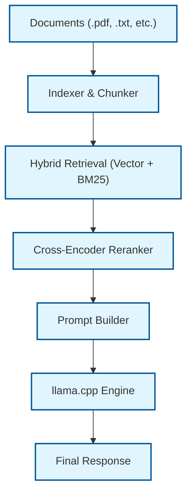

# Bringer

## Project Overview

**What Bringer is:**
Bringer is a lightweight, fully local Artificial Intelligence (AI) document assistant designed to execute directly on your desktop. It provides a conversational interface to query your private documents (`.pdf`, `.docx`, `.txt`, `.md`) using locally hosted Large Language Models (LLMs).

**Why it exists:**
Navigating complex local ML setups and hardware constraints can be difficult for standard document retrieval. Bringer bridges the gap by offering an intelligent, hardware-aware Retrieval-Augmented Generation (RAG) system that automatically scales its resource usage based on your machine's current power state, ensuring responsive AI without draining battery life.

**The problems it solves:**
- **Hardware-Aware Execution:** Automatically detects available GPUs and current power states (AC vs. Battery Saver) to seamlessly transition between high-performance and low-power LLM profiles.
- **Privacy First:** Eliminates cloud dependencies. Documents are embedded, indexed, and queried entirely offline.
- **Unified RAG Pipeline:** Abstracts the complexity of document chunking, hybrid retrieval, and cross-encoder reranking into a simple CLI experience.

---

## Key Features

- **Local Execution:** 100% offline operation ensures your sensitive documents never leave your machine.
- **GGUF Model Support:** Native compatibility with quantized `.gguf` models, allowing powerful LLMs to run efficiently on consumer hardware.
- **Hardware-Aware Profile Switching:** Dynamically adjusts the active LLM based on power availability and GPU presence.
- **Hybrid Search:** Combines dense vector search (embeddings) with sparse keyword search (BM25) for highly accurate retrieval.
- **Cross-Encoder Reranking:** Re-evaluates initial search results to ensure only the most contextually relevant chunks are passed to the LLM.
- **Private Document Retrieval:** Built-in parsers for common formats natively indexed into a local vector database.
- **CUDA Acceleration:** Automatic utilization of NVIDIA GPUs when available for drastically improved inference speeds.

---

## Architecture

Bringer utilizes a streamlined Retrieval-Augmented Generation (RAG) pipeline to ensure high precision and contextual accuracy.

### Pipeline Flow



---

## Project Structure

```text
Bringer/
├── bringer_cli.py          # Command-line interface entry point
├── config.py               # Global application constants and settings
├── main.py                 # Core application launch logic
├── models.json             # User-defined hardware profiles and model paths
├── src/modules/
│   ├── config_manager.py   # State management for models and active profiles
│   ├── document_loader.py  # Parsers for PDF, DOCX, TXT, and Markdown files
│   ├── hardware_detector.py# OS-level diagnostics for GPU and power states
│   ├── hybrid_retriever.py # BM25 sparse retrieval engine
│   ├── llama_manager.py    # Wrapper and lifecycle manager for llama-cpp-python
│   ├── prompt_builder.py   # System instruction templates and context injection
│   ├── rag_pipeline.py     # Central orchestrator connecting retrieval and LLM
│   ├── reranker.py         # Cross-encoder filtering logic
│   └── vector_store.py     # ChromaDB dense embedding repository
└── tests/                  # Unit and integration test suite
```

---

## Technology Stack

- **Python 3.10+:** Core runtime environment.
- **llama-cpp-python:** Python bindings for `llama.cpp`, driving the core GGUF inference engine.
- **ChromaDB:** Lightweight, local vector database for document embeddings.
- **Rich:** Terminal formatting and real-time streaming UI.
- **Sentence-Transformers:** Powers both the dense embedding models and the cross-encoder reranking.

---

## Installation

### Prerequisites
- Python 3.10 or higher.
- Git.
- C++ Build Tools (Required for compiling local ML dependencies):
  - **Windows**: Install Visual Studio Build Tools and select the "Desktop development with C++" workload.
  - **Linux/Mac**: Standard `gcc`/`clang` toolchains.

### Setup
1. Clone the repository:
   ```bash
   git clone <your-repository-url>
   cd Bringer
   ```
2. Create and activate a virtual environment:
   ```bash
   python -m venv .venv
   
   # Windows
   .venv\Scripts\activate
   
   # Linux/Mac
   source .venv/bin/activate
   ```
3. Install the application:
   ```bash
   pip install -e .
   ```
4. Initialize your local configuration:
   ```bash
   bringer init-config
   ```

---

## Configuration

Bringer relies on a `models.json` configuration file to determine which GGUF models to load under different hardware conditions.

### GGUF Models
Bringer requires quantized models in the `.gguf` format. You must download these separately (e.g., from HuggingFace) and configure Bringer to point to their absolute file paths.

### Power Profile System
The system maintains three distinct hardware profiles:
- **High Performance:** Automatically activated when the machine is plugged into AC power. Ideal for larger, more capable models.
- **Balanced:** Activated when running on battery. Suited for mid-sized models to balance speed and power consumption.
- **Low Power:** Activated when the OS "Power Saver" mode is detected. Best for small, fast models to conserve battery life.

### Assigning Models
You must map your downloaded GGUF files to the respective profiles using the CLI:
```bash
# Set High Performance model
bringer models set high_performance llm "C:/models/large-model.gguf"

# Set Balanced model
bringer models set balanced llm "C:/models/medium-model.gguf"

# Set Low Power model
bringer models set low_power llm "C:/models/small-model.gguf"
```

### Manual Profile Switching
While Bringer defaults to automatic hardware detection, you can manually override the active profile:
```bash
bringer models profile high_performance
```
To return to dynamic, hardware-aware switching:
```bash
bringer power auto
```

---

## Usage

### Workflow

**1. Add Documents**
Place your private documents (`.pdf`, `.docx`, `.txt`, `.md`) directly into the `documents/` folder located in the root of the Bringer project directory.

**2. Build Index**
Instruct Bringer to parse, chunk, and embed the documents into the local vector database:
```bash
bringer --reindex
```

**3. Launch Bringer**
Start the interactive terminal assistant:
```bash
bringer
```

**4. Ask Questions**
Type your query and press Enter. Bringer will retrieve the most relevant document chunks and stream a context-aware response directly to your terminal.

---

## Command Reference

### Core Commands
| Command | Description |
| :--- | :--- |
| `bringer` | Start the interactive assistant. |
| `bringer --reindex` | Rebuild the search index from your `documents` folder. |
| `bringer doctor` | Checks if everything is installed and configured correctly. |
| `bringer --status` | Shows how many documents you have indexed. |
| `bringer --debug` | Start with detailed logs (useful for troubleshooting). |

### Model Commands
| Command | Description |
| :--- | :--- |
| `bringer models show` | See current model-to-profile mappings. |
| `bringer models set <profile> llm <path>` | Assign a model file to a profile. |
| `bringer models reload` | Switch to a new model without restarting. |
| `bringer models scan` | Scans the project directory for `.gguf` files. |
| `bringer models profile <name>` | Manually switch to a specific profile (e.g., `low_power`). |

### Power Commands
| Command | Description |
| :--- | :--- |
| `bringer power status` | See battery/GPU state and active profile. |
| `bringer power auto` | Enable automatic hardware-based profile switching. |
| `bringer power low` | Force Bringer into Low Power mode. |
| `bringer power balanced` | Force Bringer into Balanced mode. |
| `bringer power high` | Force Bringer into High Performance mode. |

### System Commands
| Command | Description |
| :--- | :--- |
| `bringer install` | Pure validation check of your installation. |
| `bringer update` | Safely checks for updates while preserving config. |
| `bringer uninstall` | Removes application but keeps models/config. |
| `bringer uninstall --purge` | Deletes everything including models and DB. |
| `bringer init-config` | Creates the initial `models.json` file. |

---

## Troubleshooting

- **"llama-cpp not installed":** Ensure you have installed the required C++ Build Tools for your OS prior to running `pip install llama-cpp-python`.
- **"No valid LLM is loaded":** Bringer cannot locate your model. Ensure you have downloaded a `.gguf` file and correctly assigned its absolute path using `bringer models set`.
- **CUDA Acceleration (Slow Startup / Inference):** If you have an NVIDIA GPU but inference is slow, you likely installed the CPU-only version of `llama-cpp-python`. Reinstall with CUDA bindings enabled:
  ```bash
  $env:CMAKE_ARGS="-DGGML_CUDA=on"; pip install --upgrade --force-reinstall llama-cpp-python --no-cache-dir
  ```
- **Missing Embeddings or Stale Answers:** If Bringer isn't returning information from recently added files, your vector database is out of sync. Rerun `bringer --reindex` to rebuild the index.

---

## Privacy

Bringer operates with a strict, 100% local privacy guarantee. It requires no internet connection for inference or retrieval. Your documents are embedded and stored in a local ChromaDB instance, and all mathematical operations for text generation are executed directly on your host machine's CPU or GPU. Absolutely zero telemetry, document data, or query history is transmitted externally.

---

## License

*(Placeholder)* License to be determined.
